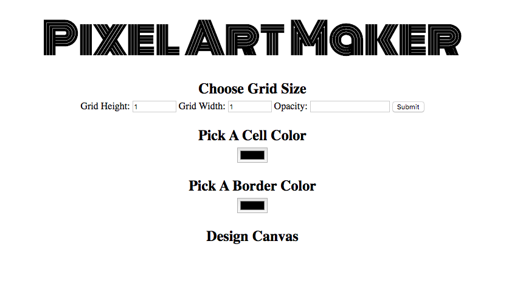
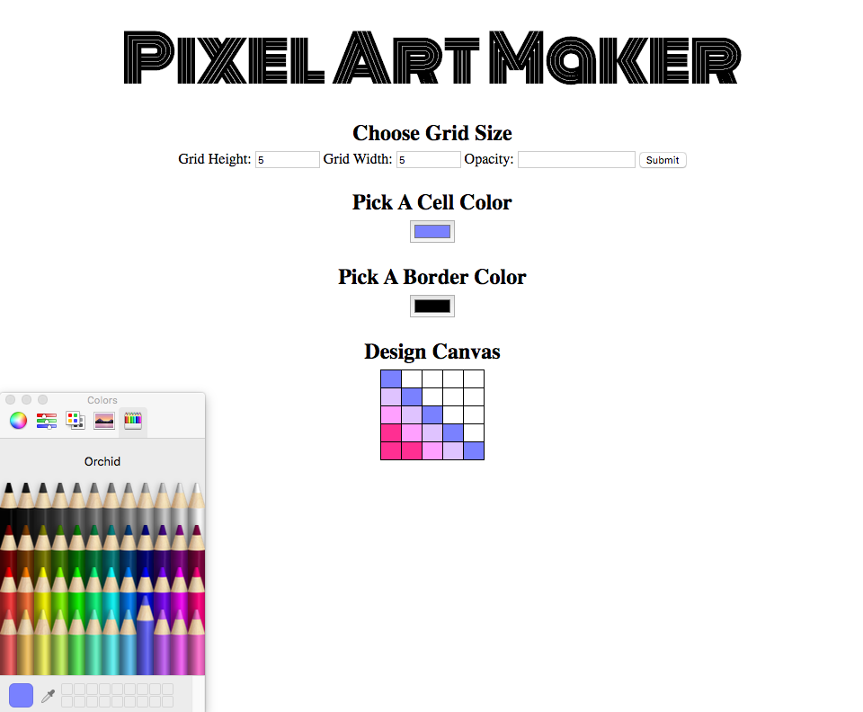

## Pixel Art Maker Project

Build a single-page web app that allows users to draw pixel art on a canvas. 
JavaScript code that lets the user create a grid of squares representing their
 design, and apply colors to those squares.

###  Instructions

To build out the app's functionality open `designs_final.js`.

To check the result open `index.html` in your browser.

### Output 

